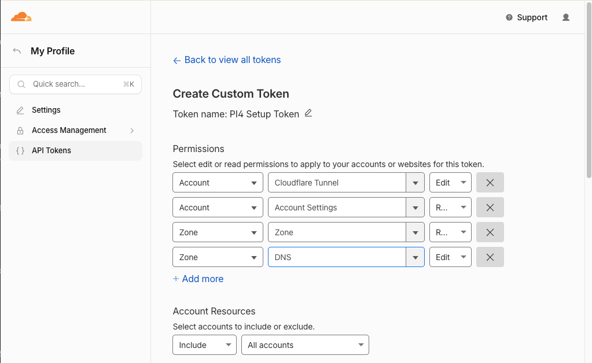
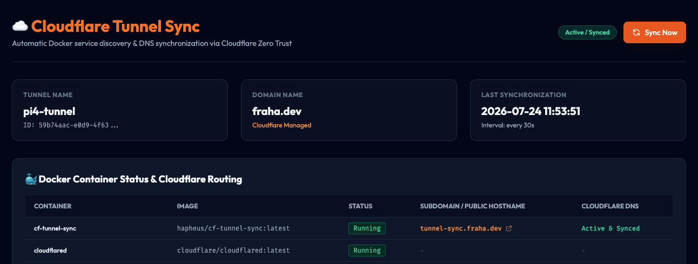

# 🚀 Cloudflare Tunnel & Docker Sync

An automated tool to dynamically expose Docker containers using a **Cloudflare Zero Trust Tunnel** and manage DNS records automatically based on container labels.

No local scripts, no cron jobs, and no complex manual tunnel setup required. Just add labels to your Docker containers, and they will be online in seconds.

---

## 📸 Screenshots & Previews

*Here are the steps and dashboard previews:*

1. **Cloudflare API Token Configuration**
   
   *(Create a custom token with specific edit rights for Zone and Cloudflare Tunnels)*

2. **Sync Dashboard Overview**
   
   *(Access your status page on port 8090 to monitor containers, DNS status, and sync logs)*

---

## ✨ Features

- **Automatic Service Discovery:** Scans running containers via `/var/run/docker.sock`.
- **Zero-Config Tunnels:** Automatically creates, configures, and runs a Cloudflare Tunnel using your API token.
- **Dynamic DNS Management:** Syncs CNAME records for labeled containers and cleans up obsolete ones when containers stop.
- **Web Dashboard:** Simple, password-protected dark-mode dashboard showing current routing status and live logs.
- **Multi-Arch Support:** Docker image works on standard Linux (AMD64) and Raspberry Pi (ARM64).

---

## 🔑 Step 1: Cloudflare API Token Setup

You only need **one API token** to manage the entire lifecycle of the tunnel and DNS records.

1. Go to your **Cloudflare Dashboard** -> **My Profile** -> **API Tokens**.
2. Click **Create Token** -> scroll down to **Create Custom Token** -> click **Get Started**.
3. Set the following permissions:
   - **Account** / **Cloudflare Tunnel** / **Edit**
   - **Zone** / **Zone** / **Read**
   - **Zone** / **DNS** / **Edit**
4. Set the **Account Resources** to **Include** -> *Your Account*.
5. Set the **Zone Resources** to **Include** -> *All Zones* (or select your specific domain).
6. Click **Continue to summary** and click **Create Token**. Copy the token string.

---

## 🛠️ Step 2: Deployment

### 1. Configure Environment Variables
Copy `.env.example` to `.env`:
```bash
cp .env.example .env
```

Open `.env` and fill in your details:
```env
DOMAIN_NAME=yourdomain.com
CLOUDFLARE_API_TOKEN=your_copied_api_token_here
CLOUDFLARE_TUNNEL_NAME=my-pi-tunnel
BASIC_AUTH_USERNAME=admin
BASIC_AUTH_PASSWORD=choose_a_secure_password
```

### 2. Run the Stack
Create a `docker-compose.yml` file:

```yaml
services:
  cloudflared:
    image: cloudflare/cloudflared:latest
    container_name: cloudflared
    restart: always
    command: tunnel --no-autoupdate run --token-file /etc/cloudflared/token
    volumes:
      - cf_token_data:/etc/cloudflared
    networks:
      - cf-tunnel-net

  cf-tunnel-sync:
    image: your-dockerhub-username/cf-tunnel-sync:latest
    container_name: cf-tunnel-sync
    restart: always
    environment:
      - CLOUDFLARE_API_TOKEN=${CLOUDFLARE_API_TOKEN}
      - DOMAIN_NAME=${DOMAIN_NAME}
      - CLOUDFLARE_TUNNEL_NAME=${CLOUDFLARE_TUNNEL_NAME:-cf-docker-tunnel-sync}
      - POLL_INTERVAL=30
      - BASIC_AUTH_USERNAME=${BASIC_AUTH_USERNAME:-admin}
      - BASIC_AUTH_PASSWORD=${BASIC_AUTH_PASSWORD:-admin}
    volumes:
      - /var/run/docker.sock:/var/run/docker.sock:ro
      - cf_token_data:/etc/cloudflared
    labels:
      - "cf.tunnel.hostname=tunnel-sync.${DOMAIN_NAME}"
      - "cf.tunnel.port=8090"
    ports:
      - "8090:8090"
    networks:
      - cf-tunnel-net

networks:
  cf-tunnel-net:
    driver: bridge

volumes:
  cf_token_data:
```

Start the containers:
```bash
docker compose up -d
```

Your Sync Dashboard is now available at `http://your-pi-ip:8090` (and will be exposed via tunnel at `https://tunnel-sync.yourdomain.com`).

---

## 🐳 Step 3: Exposing Other Containers

To expose any other container in the same Docker network, simply add the routing labels to its service definition:

```yaml
services:
  my-app:
    image: nginx:alpine
    container_name: my-app
    labels:
      - "cf.tunnel.hostname=app.yourdomain.com"
      - "cf.tunnel.port=80"
    networks:
      - cf-tunnel-net
```

- **`cf.tunnel.hostname`**: The public domain name you want to use.
- **`cf.tunnel.port`**: The internal port the container listens on (e.g. `80` for Nginx, `5678` for n8n).

> [!IMPORTANT]
> The target container must be in the same Docker network as `cf-tunnel-sync` and `cloudflared` (in this case `cf-tunnel-net`) so `cloudflared` can resolve the container's IP using its name.

---

## 🔌 Exposing Non-Docker Host Services (e.g., Local Mac / Pi Host Ports)

If you have a service running directly on your host machine (outside Docker) and you want to expose it through the tunnel, you can do this by using a **dummy container** as a bridge.

1. **How it works:**
   Since `cf-tunnel-sync` only scans Docker containers, you start a lightweight "bridge" container that holds the labels. You tell `cf-tunnel-sync` to route traffic to the special address `host.docker.internal` (which represents your host machine) using the `cf.tunnel.service` label.

2. **Add a Bridge Service to your Compose file:**
   ```yaml
   services:
     host-app-bridge:
       image: alpine
       container_name: host-app-bridge
       command: sleep infinity
       restart: always
       labels:
         - "cf.tunnel.hostname=local-service.yourdomain.com"
         - "cf.tunnel.service=http://host.docker.internal:8080" # Port running on your host OS
       networks:
         - cf-tunnel-net
   ```

*Note: The `extra_hosts` mapping `host.docker.internal:host-gateway` is already configured in the `cloudflared` compose service by default to make this work on Linux/Raspberry Pi.*

---

## ⚙️ Configuration Variables

| Variable | Description | Default | Required |
|---|---|---|---|
| `DOMAIN_NAME` | Root domain managed on Cloudflare (e.g., `example.com`). | - | Yes |
| `CLOUDFLARE_API_TOKEN` | API Token created in Step 1. | - | Yes |
| `CLOUDFLARE_TUNNEL_NAME` | The name for the Cloudflare Tunnel. | `cf-docker-tunnel-sync` | No |
| `POLL_INTERVAL` | Docker socket scan interval in seconds. | `30` | No |
| `BASIC_AUTH_USERNAME` | Web UI Dashboard username. | `admin` | No |
| `BASIC_AUTH_PASSWORD` | Web UI Dashboard password. | `admin` | No |

---

## 💝 Support the Project

If you find this project helpful, consider showing some support:

- ☕ **Buy me a coffee:** Send a tip via [PayPal](http://paypal.me/hapheus).
- 🎗️ **Charity Donation:** Donate to [Österreichische Krebshilfe (Austrian Cancer Aid)](https://www.krebshilfe.net/) or any local animal welfare organization.
- 🎯 **Dream Support:** I would love some tickets for the World Darts Championship at **Ally Pally** (Alexandra Palace) 😅 – hopefully, I will make it there one day!

